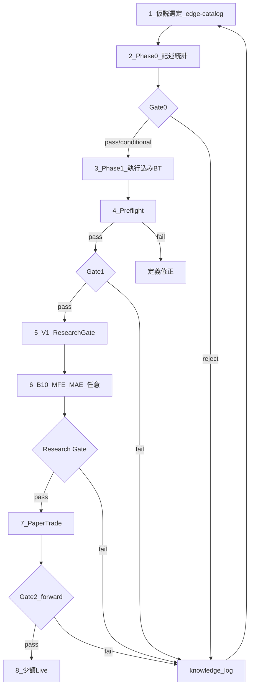

# 今後のプラン

生成: 2026-09-06（Hybrid Validation 反映）  
前提: [project-review.md](project-review.md) / [v1-validation-report.md](v1-validation-report.md)

---

## 1. 北極星（変更なし）

**Gate2**: 執行込み OOS 平均で月次 P ≥ ¥2,500（+5% / BR ¥50,000）

Gate2 候補が出るまで **実装・本番フェーズには進まない**。

**追加**: Research Gate pass は「統計的に信頼できる edge あり」と判断するが、Gate2 代替ではない。

---

## 2. 現時点の最良候補

| 候補 | Gate1 | Gate2 | Research Gate | 執行 VALIDATION P | 次アクション |
|---|---|:---:|:---:|---:|---|
| **H-D + H-M4** | Y | N | **pass** | ≈¥741 | **Paper 継続** |
| **H-F3 cd4_q40_at20** | N (N=33) | N | **pass** | ≈¥234 | N 帯改善 defer |
| **P3-C 合成** | N | N | pending | OOS2 ¥339 | zone 厳格化 defer |

---

## 3. 今後の検証フロー（標準）



### 各段のルール

| 段 | バッチ例 | データ | stop/go |
|---|---|---|---|
| Phase0 | B01–B09 | ALL | metric verdict |
| Phase1 | P1-A, P3-B | TRAIN + VALIDATION + TEST 計測 | Gate1 |
| **V1** | V1 | VALIDATION + WF 全期間 | **Research Gate** |
| B10 | B10 | TRAIN + VALIDATION | Exit 再設計判断 |
| Paper | PT-A/B | forward | Gate1 再現 + Gate2 |
| TEST 開封 | 最終 1 回 | TEST のみ | Gate2 候補時のみ |

**重要**: パラメータ tuning は **VALIDATION のみ**。月次 P 最大化は Research Loop の目的にしない。

---

## 4. 短期（次 2–3 バッチ）

### 4.1 PT-B — H-D forward 継続（最優先）

Research Gate pass 済み。Paper で執行劣化率を蓄積。

```bash
# PT-A 相当の forward 継続監視
```

### 4.2 P1-R2 — H-D Exit 再設計（defer）

B10 結果: TP 0.5% hit=73%。VALIDATION のみで grid。

| 変数 | 候補 |
|---|---|
| TP | 0.5%, 0.8%, 1.0% |
| SL | 0.5%, 0.8% |
| RR | 1:1.5, 1:2 |

**停止条件**: 3 iter 無改善 or Research Gate fail

### 4.3 P3-C-R — zone 厳格化（defer）

lookback 48 → 24。VALIDATION tuning のみ。

---

## 5. 中期

| 優先 | バッチ | 理由 |
|---:|---|---|
| 1 | P1-R2 Exit grid | B10 MFE/MAE 示唆 |
| 2 | H-A Phase1 | 執行ルール未検証 |
| 3 | H-F4 Phase0 | 新 L1 |

### 探索停止リスト（変更なし）

H-B, H-A2, H-F2, H-B+H-D 合成

### L0 再ベースライン（PM 判断）

Gate2 最大 < 50% 継続時: Gate2 → +3% or Q 見直し

---

## 6. 検証運用（更新）

1. **5 段パイプライン** + **V1 Research Gate**（Gate1 pass 候補必須）
2. **VALIDATION のみ tuning** — TEST ロック（[AGENTS.md](../../AGENTS.md)）
3. preflight 必須、Knowledge Card 必須
4. 合成: 単体 Gate1 + Research Gate 確認後
5. research loop: max 10 iter、3 iter 無改善 pivot
6. 評価優先順位: EV → WF/MC → DD → PF/Sharpe → 月次 P

---

## 7. 成功 / 撤退

### Go 実装

- VALIDATION + TEST 両方 Gate2 pass
- Research Gate pass
- Paper 3 ヶ月 Gate2 維持

### ピボット

- 追加 L1 2 本でも Gate2 < 50%
- PM: Gate2 再定義 / 銘柄変更 / pause

---

## 8. 実行コマンド

```bash
# 標準 Validation パイプライン
python3 -m scripts.phase1.run_validation_batch V1 --strategy all
python3 -m scripts.phase1.run_validation_batch B10 --strategy all
python3 -m scripts.phase1.run_p3_batch P3-C

# Phase0 / Phase1
python3 -m scripts.phase0.run_batch B09
python3 -m scripts.phase1.run_p3_batch P3-B
```

改訂: 2026-09-06
