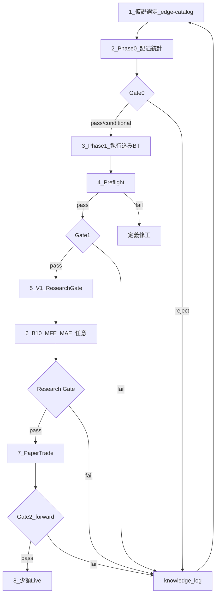

# 今後のプラン

生成: 2026-09-06（PM-20260906 判断反映）  
前提: [pm-decisions.md](pm-decisions.md) / [project-review.md](project-review.md)

---

## 1. 北極星（変更なし）

**Gate2**: 執行込み OOS 平均で月次 P ≥ ¥1,500（+3% / BR ¥50,000）

旧 Gate2（+5% / ¥2,500）は 2026-09-06 まで。再採点: [gate2_rescore_3pct.json](../../data/research/gate2_rescore_3pct.json)

Gate2 候補が出るまで **実装・本番フェーズには進まない**。

**追加**: Research Gate pass は「統計的に信頼できる edge あり」と判断するが、Gate2 代替ではない。

---

## 2. 現時点の最良候補

| 候補 | Gate1 | Gate2 | Research Gate | 執行 VALIDATION P | 次アクション |
|---|---|:---:|:---:|---:|---|
| **H-D + H-M4（canonical）** | Y（TRAIN/VAL/TEST） | N | **pass** | ≈¥1,031 VAL / **¥727 TEST** | **Paper 継続**（PT-B ¥943） |
| **H-F3 cd4_q40_at20** | N (N=33) | N | **pass** | ≈¥234 | N 帯改善 defer |
| **P3-C 合成** | N | N | pending | OOS2 ¥339 | zone 厳格化 defer |

---

## 3. 今後の検証フロー（標準）



### 各段のルール

| 段 | バッチ例 | データ | stop/go |
|---|---|---|---|
| Phase0 | B01–B09 | ALL | metric verdict |
| Phase1 | P1-A, P3-B | TRAIN + VALIDATION + TEST 計測 | Gate1 |
| **V1** | V1 | VALIDATION + WF 全期間 | **Research Gate** |
| B10 | B10 | TRAIN + VALIDATION | Exit 再設計判断 |
| Paper | PT-A/B | forward | Gate1 再現 + Gate2 |
| TEST 開封 | 最終 1 回 | TEST のみ | Gate2 候補時のみ |

**重要**: パラメータ tuning は **VALIDATION のみ**。月次 P 最大化は Research Loop の目的にしない。

---

## 4. 短期（次 2–3 バッチ）

### 4.1 PT-B — H-D forward 継続監視（継続中）

**結果**: monitoring_status=**continue**, PT-Gate1 pass（EV=+¥19.2, P≈¥943, final BR=¥63,200）

**監視**: `python3 -m scripts.paper.run_pt PT-B` — 月次再実行推奨

**停止ルール**: EV≤0 または 3 連続赤字月 → pause/stop（[paper-trade-spec.md §6](paper-trade-spec.md)）

### 4.2 P1-R2 / P1-R2C — H-D Exit（完了・重要）

**P1-R2**: VALIDATION best sl=0.5%, tp=1.0% → P≈¥1,031, Research Gate pass

**P1-R2C**（固定 config、tuning なし）:

| split | EV | P | Gate1 |
|---|---|---|:---:|
| TRAIN | +¥24.5 | ¥1,148 | pass |
| VALIDATION | +¥21.2 | ¥1,031 | pass |
| TEST | +¥14.1 | ¥727 | pass |

**判定**: conditional — 全 split Gate1 pass、Gate2 未到達（TEST 29%）。**Paper 継続**。

### 4.3 P3-C-R — zone 厳格化（完了・停止）

lookback=24 は P3-C より劣化 → **zone 厳格化停止**

### 4.4 L1 探索（完了）

| batch | verdict | 要点 |
|---|---|---|
| B11 H-F4 | reject | edge なし |
| P1-HA revert | reject | EV 負、Phase0 再確認 |

---

## 5. 中期（PM-20260906 確定）

| 優先 | バッチ | 状態 |
|---:|---|---|
| 1 | **Paper PT-B**（sim） | **継続** — 月初 1 回 |
| 2 | **H-C2 Phase1**（週明けギャップ） | **完了 → reject**（P2-E） |
| 3 | **H-D4**（％水準ブレイク）30-cycle NR | **完了 → weak-positive / reject** |
| 4 | **H-D5**（ピンバー）Phase1 | **次 L1 候補** |
| 5 | H-D / H-F3 / P3 | **hold** — tuning 禁止 |

**禁止**: live paper、少額 Live、H-D パラメータ tuning、棄却リスト再探索

### 探索停止リスト（変更なし）

H-B, H-A2, H-F2, H-B+H-D 合成

### L0 再ベースライン（PM 判断）

Gate2 最大 < 50% 継続時: Gate2 → +3% or Q 見直し

---

## 6. 検証運用（更新）

1. **5 段パイプライン** + **V1 Research Gate**（Gate1 pass 候補必須）
2. **VALIDATION のみ tuning** — TEST ロック（[AGENTS.md](../../AGENTS.md)）
3. preflight 必須、Knowledge Card 必須
4. 合成: 単体 Gate1 + Research Gate 確認後
5. research loop: max 10 iter、3 iter 無改善 pivot
6. 評価優先順位: EV → WF/MC → DD → PF/Sharpe → 月次 P

---

## 7. 成功 / 撤退

### Go 実装

- VALIDATION + TEST 両方 Gate2 pass
- Research Gate pass
- Paper 3 ヶ月 Gate2 維持

### ピボット

- 追加 L1 2 本でも Gate2 < 50%
- PM: Gate2 再定義 / 銘柄変更 / pause

---

## 8. 実行コマンド

```bash
# 標準 Validation パイプライン
python3 -m scripts.phase1.run_validation_batch V1 --strategy all
python3 -m scripts.phase1.run_validation_batch B10 --strategy all
python3 -m scripts.phase1.run_p3_batch P3-C

# Phase0 / Phase1
python3 -m scripts.phase0.run_batch B09
python3 -m scripts.phase1.run_p3_batch P3-B
```

改訂: 2026-09-06
