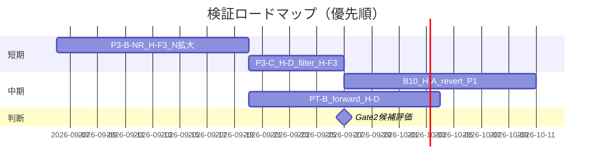

# 今後のプラン

生成: 2026-09-06  
前提: [project-review.md](project-review.md) の全体レビュー

---

## 1. 北極星（変更なし）

**Gate2**: 執行込み OOS 平均で月次 P ≥ ¥2,500（+5% / BR ¥50,000）

Gate2 候補が出るまで **実装・本番フェーズには進まない**（SPEC 方針）。

---

## 2. 現時点の最良候補（hold）

| 候補 | 状態 | 執行 OOS P | 次のアクション |
|---|---|---:|---|
| **H-D + H-M4** | Gate1 pass | ≈¥740–1,127 | Paper 継続監視 or live 小額試験（PM 判断） |
| **H-F3 レンジ回帰** | Phase0 promote / P3-B N 不足 | ≈¥261（OOS2） | **N 拡大 research loop**（最優先 L1 探索） |

---

## 3. フェーズ別ロードマップ



※ 日付は目安。Cloud Agent では **技術的依存関係**で進める。

---

## 4. 短期（次 2–3 バッチ）

### 4.1 P3-B-NR — H-F3 N 帯拡大（完了）

**結果**: Gate1 pass 設定 `cd4_q40_at20`（OOS P≈¥256, N≈40/月）。Gate2 不可。

→ 詳細: [p3bnr-research-report.md](p3bnr-research-report.md)

### 4.2 P3-C — H-D フィルタ + H-F3（最優先）

**問い**: cooldown / 検出条件緩和で N→50/月にしつつ OOS 執行 EV>0 を維持できるか？

| 変数 | 探索方向 |
|---|---|
| cooldown | 12 → 6, 4（N 増） |
| 12h range 閾値 | q20 → q30（イベント増） |
| edge touch | 0.1 ATR → 0.15 ATR |
| RR | 1:2 → 1:3 |

**停止条件**: 3 iter 連続で OOS P < ¥500 または EV 符号反転

**成功条件**: OOS Gate1 pass（EV>0, N=40–60）→ P3-C へ

### 4.2 P3-C — H-D フィルタ + H-F3（条件付き）

**前提**: P3-B-NR で H-F3 単体 OOS Gate1 pass

**問い**: RSI 初押し zone 内のみ H-F3 エントリー許可で edge 増幅するか？

**合成ルール**: H-F3 単体 Gate1 必須（P2-C 教訓）

### 4.3 PT-B — H-D forward 継続

PT-A と同型。Gate2 forward 再現は expect しないが、**執行劣化率の実測**を蓄積。

---

## 5. 中期（Gate2 未到達が続く場合）

### 5.1 L1 探索の追加候補

| 優先 | 仮説 | 理由 |
|---:|---|---|
| 1 | H-F3 派生（N 拡大） | Phase0 promote、Phase1 edge 正（OOS2） |
| 2 | H-A 回帰（Phase1 未実施） | Phase0 reject だが執行ルール未検証 |
| 3 | H-F4 減速反転 | Phase0 未実行 |
| 4 | H-C セッション + H-D | B01 conditional の Phase1 化 |

### 5.2 探索停止リスト（再検証不要）

- H-B EARLY/PULL/合成
- H-A2 継続
- H-F2 中点回帰
- H-B + H-D 合成

### 5.3 L0 再ベースライン検討（PM 判断）

Gate2 に届かない場合の選択肢:

| オプション | 内容 | リスク |
|---|---|---|
| A | Gate2 を +3%（¥1,500）に再定義 | 本番期待値の下方修正 |
| B | Q / レバレッジ条件の見直し | L0 変更 → 全再検証 |
| C | L2 探索継続（現方針） | 時間対効果 |

**推奨**: オプション C を継続し、**P3-B-NR 完了後**に A/B を PM が判断。

---

## 6. 検証運用（継続ルール）

1. **5 段パイプライン**を全 Phase1/Phase3 batch で適用
2. **preflight 必須** — fail 時は計測せず定義修正
3. **Knowledge Card** — pass/fail 問わず 1 件
4. **合成禁止** — 単体 OOS Gate1 未達コンポーネント
5. **research loop** — 同一 L1 で max 10 iter、3 iter 無改善で pivot

---

## 7. 成功シナリオ / 撤退シナリオ

### 成功（Go 実装）

- いずれか 1 ロジックが **OOS1 + OOS2 両方** Gate2 pass
- Paper trade で 3 ヶ月 forward Gate2 維持
- → Phase2 実装仕様ドラフト

### 撤退 / ピボット

- P3-B-NR + P3-C + 追加 L1 2 本でも Gate2 最大 < 50%
- → PM 判断: (1) Gate2 再定義 (2) 銘柄/足変更 (3) プロジェクト pause

---

## 8. 次の 1 手（Agent 実行待ち）

```bash
# 1. P3-B-NR research loop（H-F3 N 拡大）
python3 -m scripts.research.p3b_nr_loop   # 実装予定

# 2. 結果を KB + project-review 更新
# 3. Gate1 pass なら P3-C
```

改訂: 2026-09-06
