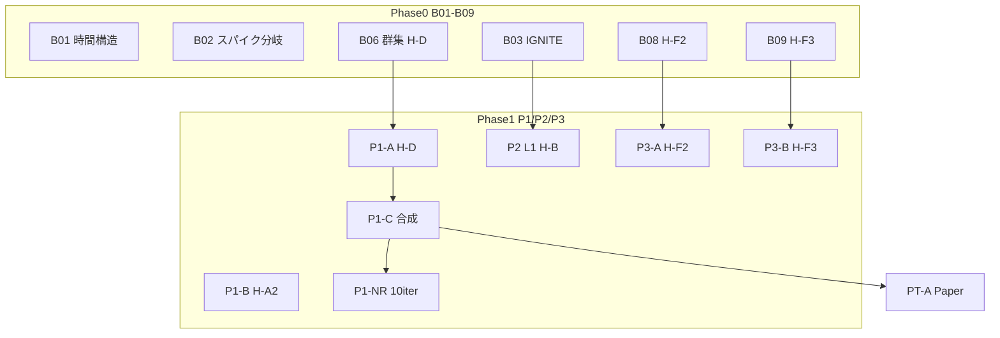

# プロジェクト全体レビュー

生成: 2026-09-06  
対象: BTC/JPY 自動売買ボット — リサーチ・検証フェーズ  
データ: GMO Coin 5m、2024-01-01..2026-08-31（276,646 bars）

---

## 1. エグゼクティブサマリー

**ゴール（SPEC v0.2）**: 執行込みで月次 +5%（¥2,500 / BR ¥50,000）を OOS 平均で達成するロジックの発見。

**現状**: **Gate2 pass 候補はゼロ**。Gate1（取引可能エッジ）を安定 pass するのは **H-D + H-M4 のみ**。全局執行 OOS 月次 P の最良値は **≈¥1,127**（P1-NR、Gate2 の 45%）。

**プロジェクトの健全性**: 検証インフラ（Phase0→Phase1→Paper、KB、5 段パイプライン + preflight）は **機能している**。棄却・conditional の蓄積は「失敗」ではなく、**再現性の高い学習**として価値がある。

---

## 2. 検証履歴マップ

---

## 3. フェーズ別結果一覧

### 3.1 Phase0（記述統計 — 歪みの存在確認）

| batch | 主仮説 | verdict | 要点 |
|---|---|---|---|
| B01 | H-E, H-C, H-M4 | conditional | 土日フィルタ（H-M4）有効 |
| B02 | H-A vs H-A2 | promote | **H-A2 継続 > H-A 回帰** |
| B03 | H-B IGNITE | conditional | EARLY≈LATE 優位、絶対 edge 極小 |
| B04 | H-B2/B3 | reject | 独立候補なし |
| B05 | H-F1 | reject | n 不足 |
| B06 | H-D 群集 | conditional | **PULL > RAW** |
| B07 | 稀イベント | conditional/reject | 単体 Phase1 候補なし |
| B08 | H-F2 ボラ急騰 | conditional | MID > CONT（weak） |
| **B09** | **H-F3 レンジ回帰** | **promote** | hit 64%、mean edge +0.096%、BREAK 対照に明確優位 |

### 3.2 Phase1 / L1 / Phase3（執行込み — 取引可能エッジ）

| batch | 仮説 | verdict | OOS 執行P（最良） | Gate1 | Gate2 |
|---|---|---|---|:---:|:---:|
| P1-A | H-D + H-M4 | conditional | ≈¥1,013 | Y | N |
| P1-B | H-A2 | reject | EV 負 | N | N |
| P1-C | H-D 合成 | conditional | ≈¥741–884 | Y | N |
| P1-R | SL/TP grid | conditional | ≈¥812 | Y | N |
| P1-NR | N×RR×R 10iter | conditional | **≈¥1,127** | N* | N |
| PT-A | forward sim | conditional | ≈¥692 | Y | N |
| P2-A〜D | H-B L1 | reject/cond | ≈¥181–386 | 不安定 | N |
| P3-A | H-F2 | reject | −¥27〜−¥211 | N | N |
| **P3-B** | **H-F3** | **reject** | **≈¥261（OOS2）** | N** | N |

\* P1-NR 最良: EV>0 だが N 帯超過で Gate1 fail  
\** P3-B: OOS2 EV=+¥18.7、W=71% だが **N≈14/月**（帯 40–60 不足）

---

## 4. 仮説カタログ現状（採用判断）

| ID | 判定 | 役割 |
|---|---|---|
| **H-D** | **conditional（最良 L2）** | エントリー本体。RSI 初押し + H-M4 |
| **H-M4** | **必須フィルタ** | 土日停止、N 帯調整 |
| H-M5 | フィルタ有効 | 遅入禁止（LATE 対照で EV 正） |
| H-B | reject | Phase1/L1 とも Gate2 不可 |
| H-A2 | reject | Phase0 promote → Phase1 非再現 |
| H-F2 | reject | Phase0 weak → Phase1 執行 EV 負 |
| **H-F3** | **Phase0 promote / Phase1 N 不足** | edge は OOS2 で確認、頻度がボトルネック |
| H-A, H-B2/B3, H-F1 | reject | — |

---

## 5. 構造的な学び（L0–L3）

### L3（損益）— ボトルネック

- Gate2 必要 EV ≈ **¥50/回**（N=50、Q=¥10,000）
- 最良執行 EV ≈ **¥17–22/回**（H-D）→ **約 1/3 不足**
- P1-NR で N×RR×R を 10 iter 探索しても **Gate2 最大 45%**

### L2（エッジ）— Phase0 vs Phase1 ギャップ

| パターン | 例 | 教訓 |
|---|---|---|
| Phase0 promote → Phase1 reject | H-A2 | 記述統計のみでは不十分 |
| Phase0 weak → Phase1 reject | H-F2 | preflight 符号 warn が有効 |
| Phase0 promote → Phase1 edge 正・N 不足 | **H-F3** | 頻度設計が L1 制約 |
| Phase0 conditional → Phase1 Gate1 pass | H-D | **唯一安定再現** |

### L1（頻度）— N 帯 40–60/月

- cooldown 調整で H-D は N≈50 を達成
- H-F3 はイベント母数は 166/月だが、cooldown + 執行 fill で **≈12/月** に激減
- H-B / H-F2 はイベント過多（1,000+/月）→ 厳格フィルタで edge 消失

### 合成ルール

- H-B + H-D: **H-D 単体より 50% 以上劣化** → 不採用
- 未検証: H-D フィルタ + H-F3（P3-C defer）

---

## 6. 検証インフラの評価

| 要素 | 状態 | 評価 |
|---|---|---|
| SPEC / Gate 定義 | v0.2（Gate2 = +5%） | 明確 |
| verification-workflow | 正本あり | 運用可能 |
| verification-roadmap | 5 段パイプライン | 今回確立 |
| Knowledge Card | 全 batch 記録 | 良好 |
| preflight | 符号・シグナル数 | **H-F2 で warn 捕捉、H-F3 で pass** |
| 成果物 JSON | git_commit 付き | 再現性向上 |
| Paper trade | PT-A 1本 | Gate2 未到達確認 |
| 実装フェーズ | 未着手 | Gate2 候補なしのため妥当 |

**改善点**

1. Phase0 イベント定義と Phase1 シグナルの **定義 parity テスト**を CI 化
2. VOL_SHOCK / RANGE_BOUND の **検出厳格化**（頻度過多・過少の両方）
3. Gate2 未到達時の **EV ギャップ分解レポート**（W vs EV vs N）の自動化

---

## 7. プロジェクト全体レビュー（PM 向け）

### 強み

1. **棄却を速く、理由を残す**文化が定着（KB 20+ 件）
2. **執行込み二列**により Phase0 の過大評価を排除
3. **Gate 再ベースライン**（+20%→+5%）後も全 fail → 問題は目標値ではなく edge 絶対値
4. H-D + H-M4 は **Gate1 を OOS で安定 pass** — 「取引可能な弱い edge」は確認済み

### 弱み / リスク

1. **Gate2 到達の見通しがまだない** — L2 仮説の探索余地はあるが H-B 本命は脱落
2. **Phase0 promote の偽陽性** — B09→P3-B のように Phase0 pass でも N 帯で Phase1 fail
3. **単一銘柄・単一期間** — OOS2 のみ pass パターン（H-B）の過学習リスク
4. **実装・本番未着手** — 意図的だが、執行モデル（fill 70% 等）は未検証の仮置き

### 総合判断

| 観点 | 評価 |
|---|---|
| リサーチプロセス | **A-**（再現性・記録は高水準。定義 parity に改善余地） |
| ロジック候補 | **C**（Gate1 1 本、Gate2 ゼロ） |
| ゴール達成見込み | **低〜中**（現 L2 単体では不足。L1 変更 or 目標再定義が必要） |
| 継続推奨 | **Yes** — 検証コスト対効果は高い。H-F3 N 拡大 or 新 L1 が次の焦点 |

---

## 8. 関連ドキュメント

| ドキュメント | 内容 |
|---|---|
| [verification-roadmap.md](verification-roadmap.md) | 5 段パイプライン・バッチキュー |
| [future-plan.md](future-plan.md) | 今後のプラン（正本） |
| [phase0-summary.md](phase0-summary.md) | Phase0 総括 |
| [p1nr-research-report.md](p1nr-research-report.md) | N×RR×R 10iter |
| [l1-exploration-report.md](l1-exploration-report.md) | H-B L1 |
| [p3-exploration-report.md](p3-exploration-report.md) | H-F2/F3 |

改訂: 2026-09-06
