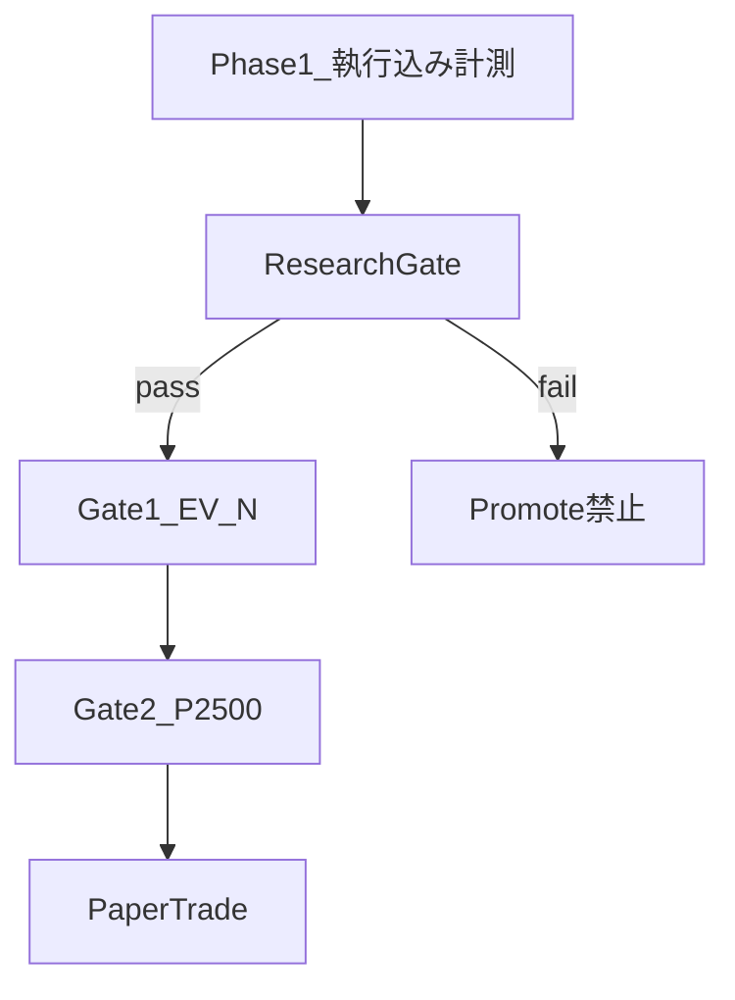

# 検証レイヤー仕様（Hybrid Validation）

Research Gate / Walk Forward / Monte Carlo / MFE/MAE / Robustness の正本。  
L0 制約は [SPEC.md](../SPEC.md)、運用は [verification-workflow.md](verification-workflow.md)。

---

## 1. 二層評価



| 層 | 問い | 使用場面 |
|---|---|---|
| Research Gate | 統計的に信頼できる edge か | promote, Paper 移行 |
| Gate1 / Gate2 | ビジネス目標に届くか | 実装・本番判断 |

**Research Loop は Research Gate で stop/go。** Gate2 は結果として確認する。

---

## 2. データ分割

| 名称 | 旧名称 | 期間 | 用途 |
|---|---|---|---|
| TRAIN | IS | 2024-01-01 .. 2025-06-30 | 戦略開発 |
| VALIDATION | OOS1 | 2025-07-01 .. 2026-02-28 | パラメータ調整 |
| TEST | OOS2 | 2026-03-01 .. 2026-08-31 | 最終判定のみ |

### Legacy contamination

P1-NR / P3-B-NR で TEST（OOS2）を iter 中に参照済み。  
**2026-09-06 以降**: tuning は VALIDATION のみ。TEST は Gate2 候補の最終判定 1 回。

---

## 3. Research Gate 基準

| チェック | 基準 |
|---|---|
| executed EV | > 0 |
| Profit Factor | ≥ 1.15 |
| maxDD | ≤ ¥7,500（15% BR） |
| Walk Forward pass rate | ≥ 60%（3 窓中 2 以上で EV>0, PF≥1.0） |
| Monte Carlo p95 DD | ≤ ¥7,500 |
| Monte Carlo ruin prob | ≤ 5% |
| Robustness | fee/slip +20% で PF ≥ 1.0 |

実装: `scripts/phase1/validation/research_gate.py`

---

## 4. Walk Forward

| Window | Train | Test |
|---:|---|---|
| 1 | 2024-01 .. 2025-06 | 2025-07 .. 2026-02 |
| 2 | 2024-01 .. 2025-12 | 2026-01 .. 2026-08 |
| 3 | 2024-07 .. 2025-12 | 2026-01 .. 2026-08 |

各 test 窓で EV, P, PF, maxDD を記録。pass = EV>0 かつ PF≥1.0。

---

## 5. Monte Carlo

- 入力: executed PnL 列
- 1,000 sim: bootstrap with replacement
- 出力: p5/p50/p95 DD, P(profit), P(ruin)
- ruin threshold: -¥25,000（50% BR）

追加: trade-order shuffle（順序依存性チェック）

---

## 6. Robustness

| シナリオ | 変更 |
|---|---|
| baseline | 現行 |
| fee_plus_20pct | TRADE_FEE × 1.2 |
| slip_plus_20pct | MARKET_SLIP × 1.2 |
| fee_slip_plus_20pct | 両方 × 1.2 |

pass: fee_slip シナリオで PF ≥ 1.0

---

## 7. MFE / MAE（B10）

エントリー後の excursion を計測し Exit 設計に使用。

| 指標 | 意味 |
|---|---|
| MFE | 最大有利方向変動（%） |
| MAE | 最大不利方向変動（%） |
| mfe_mae_ratio | MFE/MAE 平均比 |
| edge_efficiency | 実現 ret / MFE（勝ちトレード） |

TP/SL grid: 0.5%〜2.0% 候補の hit rate 比較。**VALIDATION のみ。**

---

## 8. バッチ

| batch | 目的 | 出力 |
|---|---|---|
| **V1** | Gate1 pass 候補の WF+MC+Robustness | `data/validation/v1_*.json` |
| **B10** | MFE/MAE Exit 分析 | `data/validation/b10_*.json` |

```bash
python3 -m scripts.phase1.run_validation_batch V1 --strategy all
python3 -m scripts.phase1.run_validation_batch B10 --strategy all
python3 -m scripts.phase1.run_p3_batch P3-C
```

---

## 9. Strategy Registry

全戦略の lifecycle 記録: [strategy-registry.md](strategy-registry.md) / `data/research/strategy_registry.json`

改訂: 2026-09-06
