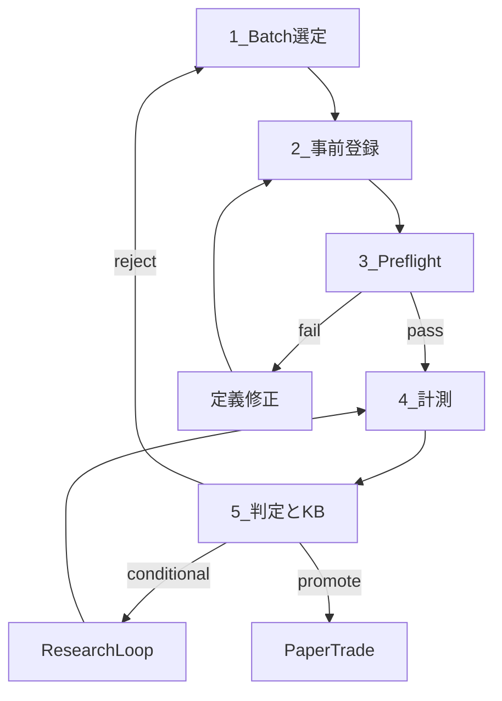
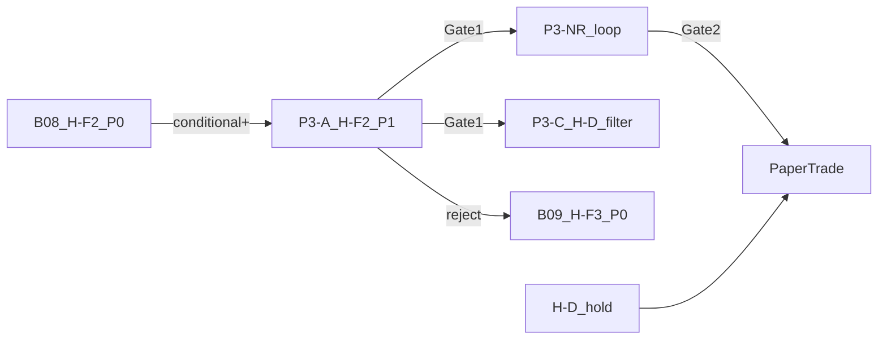

# 検証ロードマップ

ゴール: **執行込みで Gate2（月次 +5% = ¥2,500）を OOS 平均で満たすロジック**の発見・採用。

本書は [verification-workflow.md](verification-workflow.md) を補完する **PM 向けマスター計画**。

---

## 現在地（2026-09-06）

| 仮説 | Phase0 | Phase1/L1 | 執行 OOS P | Gate2 |
|---|---|---|---|:---:|
| H-D + H-M4 | conditional | conditional | ≈¥740–1,127 | fail |
| H-B | conditional | **reject** | ≈¥181（OOS2 のみ） | fail |
| H-A2 | promote | reject | EV 負 | fail |
| **H-F2** | **未実行 → B08** | P3-A 待ち | — | — |

**教訓**

1. Phase0 優位 ≠ Phase1 再現（H-A2, H-B）
2. パラメータ探索だけでは Gate2 未到達（P1-R / P1-NR）
3. 合成は各コンポーネント単体 Gate1 必須（P2-C 劣化）
4. 実装定義ズレは preflight なしでは n=0 バグを見逃す（L1 pullback）

---

## 5 段パイプライン



| 段 | 成果物 | 再現性の鍵 |
|---|---|---|
| 1. 選定 | edge-catalog status | todo / defer のみ着手 |
| 2. 事前登録 | KB: decision_question, if_pass/fail | 計測前固定 |
| 3. Preflight | `scripts/research/preflight.py` | シグナル数・符号一致 |
| 4. 計測 | 理論 / 執行 二列 + IS/OOS | phase1-spec 準拠 |
| 5. 判定 | KB + JSON + catalog | git_commit 付き JSON |

---

## 停止ルール

| 条件 | アクション |
|---|---|
| 同一 L1 で 3 iter 連続 Gate2 進展なし | パラメータ探索停止 → L1 pivot |
| OOS Gate1 不安定（1 split のみ pass） | conditional 記録、promote 禁止 |
| 合成で単体より劣化 | 合成 reject |
| preflight fail | 計測せず定義修正 |

---

## バッチキュー



| 優先 | batch | 状態 |
|---:|---|---|
| 1 | **B08** H-F2 Phase0 | **完了** — conditional |
| 2 | **P3-A** H-F2 Phase1 | **完了** — reject |
| 3 | **B09** H-F3 Phase0 | **完了** — promote |
| 4 | **P3-B** H-F3 Phase1 | **完了** — N 不足 conditional |
| 5 | **P3-B-NR** H-F3 N 拡大 | **次バッチ（最優先）** |
| 6 | P3-C H-D filter + H-F3 | P3-B-NR Gate1 後 |
| hold | H-D + H-M4 paper | PT-A 継続 |
| hold | H-D + H-M4 paper | PT-A 継続監視 |

---

## 合成ルール

> 各コンポーネントが **単独で OOS Gate1 pass** してから合成する。  
> H-D は **フィルタ** として載せる場合のみ例外（P3-C）。

---

## 成果物の再現性契約

各 `data/*/batch_results.json` に付与:

- `spec_version`, `git_commit`, `sample_period`, `n_bars`
- Phase1+: `preflight` 結果

同一 commit + 同一 parquet → 同一結果。

---

## 実行コマンド

```bash
# Phase0
python3 -m scripts.phase0.run_batch B08

# Phase3（preflight 込み）
python3 -m scripts.phase1.run_p3_batch P3-A

# Research loop（P3-NR 設定例）
python3 -m scripts.research.research_loop --config data/research/p3nr_config.json
```

改訂: 2026-09-06
