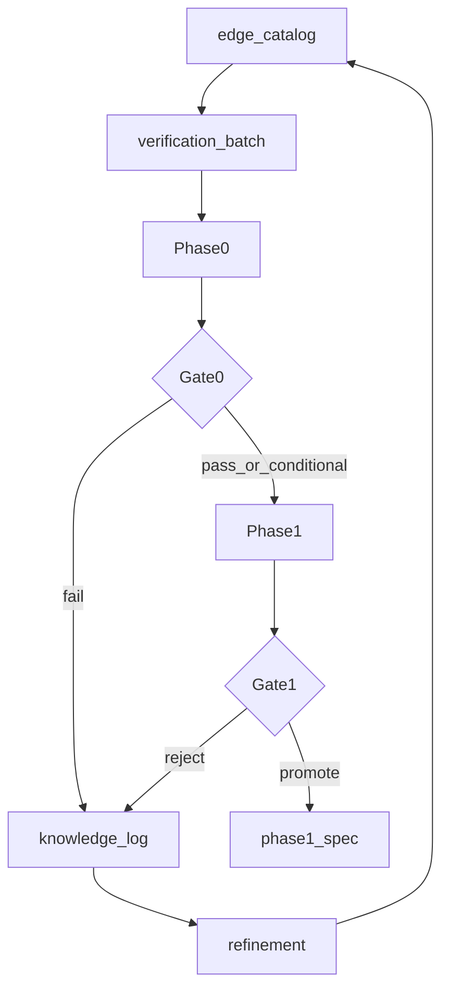
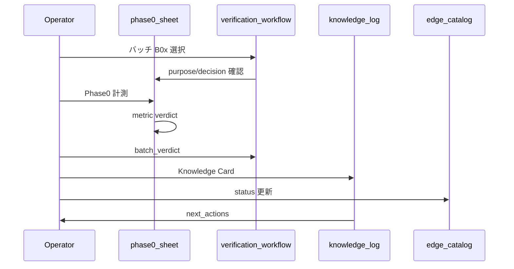

# 検証フロー — 運用正本

仮説の良し悪しを公正に評価し、検証結果をナレッジとして蓄積し、次の仮説・バッチに接続するための手順書。  
資金・N・執行・Phase1 合格基準は [SPEC.md](../SPEC.md) を参照。本書は **検証の進め方** の正本とする。

---

## 1. 三原則

| 原則 | 運用上の意味 |
|---|---|
| **適切な評価** | 計測・バックテストの **実行前** に判定基準（`decision_question`, `if_pass`, `if_fail`）を書く。事後の都合解釈で verdict を変えない |
| **情報の蓄積** | すべての検証バッチは [knowledge-log.md](knowledge-log.md) に **Knowledge Card を1件** 残す（pass でも fail でも） |
| **目的の明確化** | 各バッチに `purpose`（なぜ今やるか）を必須化。metric 行にも同じ batch の purpose を紐付ける |

---

## 2. 検証の単位：Verification Batch

「仮説IDを1つずつ」ではなく **検証バッチ（B01, B02, …）** を単位に進める。

1バッチに含めるもの:

| 要素 | 内容 |
|---|---|
| 問い | このバッチで **1文で答えること** |
| 主仮説 | 1〜2 ID（例: H-B） |
| 対照 | 同イベントの別解釈、または遅入・継続 vs 回帰 |
| 指標 | [phase0-verification-sheet.csv](phase0-verification-sheet.csv) の metric_id 群 |
| 事前判定 | pass 時 / fail 時に **次に何をするか**（実行前に固定） |
| 事後 | Knowledge Card 1件 + カタログ status 更新 |

---

## 3. Phase ゲート（各 Phase の目的）

| Phase | 目的 | 問い | 進む条件 | 止める条件 |
|---|---|---|---|---|
| **0** | 歪みの存在確認（安い棄却） | 「このメカニズムは統計的に残っているか？」 | metric `verdict`: pass / 条件付き weak | fail / insufficient_n |
| **1** | 取引可能なエッジ | 「執行込みで EV・N・P が目標帯に届くか？」 | 執行込み OOS で EV 正・P 安定（SPEC §8.3） | 理論のみ正 / 執行崩壊 / 過学習 |
| **2** | 追加データが要る仮説 | 「外部系列・板でエッジが増幅するか？」 | Phase2 データ取得後に同型バッチ | データ不可・効果なし |

Phase0 ではロジックを組まない。Phase1 では **理論値と執行込みの二列** を必ず出す（SPEC §7）。

---

## 4. 推奨バッチ一覧

実行順は下表のとおり。詳細な metric 定義は [phase0-stats.md](phase0-stats.md)。

| batch_id | purpose（なぜ今やるか） | 主仮説 | 対照 | 含む metrics | バッチで決めること |
|---|---|---|---|---|---|
| **B01** | 時間構造の歪みを低コストで確認し、フィルタ採用可否を決める | H-E, H-C, H-C4 | ランダム同時刻窓 | P0-HE-*, P0-HC4-*, P0-HC-* | セッション / 6:00 / 土日ゲート（H-M4）を採用するか |
| **B02** | スパイク後に「回帰」と「継続」どちらが優位か分岐する | H-A | H-A2 | P0-HA-REVERT, CONT, REVERT15, PATH, BY-SESS | Phase1 候補を H-A か H-A2 に絞る |
| **B03** | 点火エッジが「早期性」に依存するか検証する | H-B | 遅入（LATE） | P0-HB-EARLY, LATE, PULL, FREQ, BODY | H-B を進めるか、遅入禁止（H-M5）を必須化するか |
| **B04** | 点火の亜型（圧縮解放・スイング連鎖）を独立候補にするか判断 | H-B2, H-B3 | H-B（B03 結果） | P0-HB2-*, P0-HB3-* | 独立 Phase1 候補か H-B に統合か |
| **B05** | 上位トレンド内の行き過ぎ押しが再開エッジを持つか | H-F1 | 押し待ちなし（CTRL） | P0-HF1-* | Phase1 に載せるか |
| **B06** | 群集シグナルは「即入り」より「押し待ち・上位整合」か | H-D 系 | RAW vs PULL / ALIGN | P0-HD-* , P0-HD2〜5 | 執行ルール（押し待ち・12h 整合）を葉に固定するか |
| **B07** | 稀イベントに Phase1 載せる価値があるか | H-A3, H-A4, H-C2, H-B4 | — | P0-HA3/4, P0-HC2, P0-HB4 | 載せる / defer / 棄却 |

### Phase1 バッチ（Phase0 完了後）

| batch_id | purpose | 主仮説 | 対照 | バッチで決めること |
|---|---|---|---|---|
| **P1-A** | H-D の取引可能エッジ | H-D | RAW / ランダム | Gate1/2 pass か |
| **P1-B** | H-A2 SPIKE 継続の取引可能エッジ | H-A2 | H-A 回帰 / ランダム | Gate1/2 pass か |
| **P1-C** | 合成ロジック | composite | — | P1-A/B pass 候補 + H-M4 |
| **P1-R** | SL/TP 幅グリッド | H-D + H-M4 | P1-A baseline | Gate2（月次 P≥¥2,500 = 5% of BR）到達可能な葉を選定 |
| **P1-NR** | N×RR×R 10iter loop | H-D + H-M4 | P1-N 後 | N=20/50 × RR1:3/1:5 + R 探索 |

定義: [p1nr-spec.md](p1nr-spec.md) / [p1nr-research-report.md](p1nr-research-report.md)

### Phase0 延長 / Phase3（L1 探索後）

| batch_id | purpose | 主仮説 | 対照 | バッチで決めること |
|---|---|---|---|---|
| **B08** | ボラ急騰後の平均回帰 edge | H-F2 | CONT 継続 | P3-A へ promote するか |
| **P3-A** | H-F2 執行込み検証 | H-F2 MID | CONT | Gate1/2 pass か |
| **P3-C** | H-D フィルタ + H-F3 合成 | H-F3 + H-D zone | H-F3 単体 | edge 増幅するか |

### Hybrid Validation（Research Gate）

| batch_id | purpose | 対象 | バッチで決めること |
|---|---|---|---|
| **V1** | WF + MC + Robustness | H-D, H-F3 Gate1 pass 設定 | Research Gate pass か |
| **B10** | MFE/MAE Exit 分析 | H-D, H-F3 | TP/SL 再設計候補 |

定義: [validation-spec.md](validation-spec.md)

定義: [phase3-spec.md](phase3-spec.md) / [verification-roadmap.md](verification-roadmap.md)

**Preflight（Phase1/Phase3 必須）**: `scripts/research/preflight.py` — シグナル数 > 0、Phase0 符号一致。fail 時は計測しない。

**合成ルール**: 各コンポーネントが単独 OOS Gate1 pass 後のみ合成可（P2-C 教訓）。

### Paper Trade（Phase1 後）

| batch_id | purpose | 主仮説 | 対照 | バッチで決めること |
|---|---|---|---|---|
| **PT-A** | フォワード sim | H-D + H-M4 | Phase1 P1-C | Gate1 forward 再現 + 複利 BR |

定義: [paper-trade-spec.md](paper-trade-spec.md) / [n-sensitivity-spec.md](n-sensitivity-spec.md)

定義: [phase1-spec.md](phase1-spec.md)

**バッチ完了の定義**: 対象 metric の計測完了 + バッチ判定 + Knowledge Card 記入 + [edge-catalog.md](edge-catalog.md) の status 更新。

---

## 5. 評価ルーブリック

### 5.1 metric 単位（Phase0）

[phase0-stats.md §1.2](phase0-stats.md) に従う。

| verdict | 意味 |
|---|---|
| pass | n 十分、mean_edge がベースラインより明確に大、hit_rate ≥ 0.55 |
| weak | 方向は合うが効果小、またはサブサンプルのみ |
| fail | 符号逆、またはベースラインと差なし |
| insufficient_n | イベント数不足 |

### 5.2 バッチ単位

| batch_verdict | 条件 | 次アクション |
|---|---|---|
| **promote** | 主指標 pass、対照より優位、n 十分 | Phase1 候補キューへ。必要なら phase1 仕様ドラフトを新設 |
| **conditional** | weak だが条件（SESSION / 12h 等）を葉に固定可能 | 条件を葉に書き換え → 限定再検証（例: B03-R） |
| **reject** | fail、または対照に明確に負け | カタログ status=棄却。Knowledge Card に理由 |
| **defer** | insufficient_n | 期間延長 or Phase2 データ待ち |
| **spawn** | fail だが部分現象あり | 新仮説 ID をカタログに追加（§6） |

Phase1 への promote 条件（SPEC 接続）:

- **主判定**: 執行込みの P, N, EV
- **副**: maxDD、劣化率（理論/執行）、OOS 符号安定
- 理論値だけ pass → **hold**（promote しない）

---

## 6. 仮説ブラッシュアップ（Knowledge → 次）

Knowledge Card の `learnings` から、必ず次のいずれかを `next_actions` に書く。

| パターン | 説明 | 例 |
|---|---|---|
| **棄却** | L1 メカニズムが弱い | H-E fail → 6:00 エッジなしと記録 |
| **条件化** | 時間帯・レジーム限定 | H-B weak だが EU_US のみ pass → H-B + H-C1 |
| **分割** | 対照の勝ち方が別仮説 | REVERT 負け → H-A2 昇格 |
| **合成** | 2バッチの知見を1ロジックに | B03 pass + B01 EU_US → 点火+セッションフィルタ |
| **spawn** | 部分現象から新 ID | 圧縮のみ長い → `H-B2a` をカタログ追加 |

新 ID は [edge-catalog.md](edge-catalog.md) に追記し、`parent_metric_id` または `spawned_from` を notes に残す。

---

## 7. 1サイクルの手順

1. **選ぶ** — 次バッチ B0x を [§4](#4-推奨バッチ一覧) から選ぶ（順番推奨、必要なら defer 済みを再実行）
2. **事前記入** — シートの `batch_id`, `purpose`, `decision_question`, `paired_with` を確認（未記入なら埋める）
3. **計測** — Phase0: イベント検出 → フォワード指標 → ベースライン比較（[phase0-stats.md](phase0-stats.md)）
4. **metric 判定** — 各行に `n`, `mean_edge`, `verdict` 等を記入
5. **バッチ判定** — `batch_verdict` を1つ決める（§5.2）
6. **Knowledge Card** — [knowledge-log.md](knowledge-log.md) に1件追加（learnings / next_actions 必須）
7. **カタログ更新** — 仮説 status（探索中 / Phase1候補 / 棄却 / spawn）のみ更新。**SPEC は変更しない**
8. **次バッチ** — next_actions に従い B0(x+1) または再検証 B0x-R へ

---

## 8. 読む順序

1. [edge-catalog.md](edge-catalog.md) — 何を検証するか  
2. **本書** — どう進めるか  
3. [phase0-stats.md](phase0-stats.md) — どう測るか  
4. [phase0-verification-sheet.csv](phase0-verification-sheet.csv) — 記入  
5. [knowledge-log.md](knowledge-log.md) — 蓄積  

改訂: 2026-09-06（B08/P3 + preflight）
